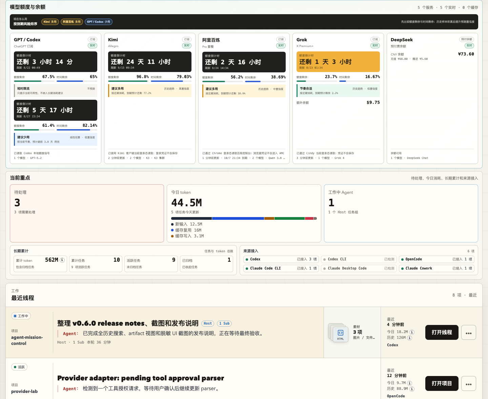

# Changelog

ASB has its own release series. The retained Agent Mission Control releases are recorded separately below.

## ASB 1.0.0

The first public ASB release provides one native GNOME window for local Codex and Claude Desktop Code chats.

- Added Compact and Comfortable views with adaptive columns, horizontal scroll, shared width, and saved layout.
- Added app/state/Pending filters, search prefixes, and direct opens in the original apps.
- Added independent ASB Read/Unread marks, Persistent unread, pins, drag order, and keyboard movement.
- Kept execution state separate from attention. Added current working time from source starts.
- Added GNOME colors and validated custom dark colors in ASB's own settings.
- Added source events, adaptive polling, row reuse, bounded caches, and an ASB reader path that omits unused dashboard work.
- Kept original chat stores read-only. ASB reads no credentials and makes no model calls or external network requests.
- Added Debian and per-user Linux packages, checksums, public docs, and a synthetic Remotion demo.

See [ASB 1.0.0 release notes](docs/releases/v1.0.0.md) for installation and limits. Linux is the native release target.

## Upstream history

The following entries are the inherited Agent Mission Control history by forxidian. They describe the upstream dashboard and its own version series, not ASB `1.0.0`. The original MIT license remains unchanged.

## [0.6.0] - 2026-08-21

### Update preview / 更新预览

> This screenshot is generated entirely from synthetic mock data. It contains no local threads, real paths, account identifiers, credentials, or actual quota and balance values.
>
> 该截图完全由虚构 mock 数据生成，不包含本机任务、真实路径、账号标识、凭证或实际额度与余额。

### English

#### Added

- Added a five-service model-resource portfolio for GPT / Codex, Kimi, Alibaba Bailian Token Plan, Grok, and DeepSeek, with normalized subscription windows, prepaid balances, model catalogs, source freshness, and explicit live/cached/external-only/error states.
- Added read-only Cindy and Kimi adapters plus an official DeepSeek balance query through `AMC_DEEPSEEK_API_KEY` or Cindy's owner-scoped Keychain credential; credentials never enter frontend payloads, and successful balance reads are throttled for 60 seconds.
- Added Cindy session support with explicit Claude Code, Codex, and Pi harness labels plus validated `cindy://session/<id>` opening, so Cindy-owned tasks return to the Cindy frontend.
- Grouped Cindy collaboration workers, provider subagents, and nested descendants under their root host. Recent threads now contain host rows only, while host badges and activity include the full descendant tree; Cindy-owned raw harness sessions are deduplicated without hiding independent client sessions, and harness-only providers are no longer presented as independently used clients.
- Reworked subscription quota cards around a prominent time-to-reset countdown, paired quota/time remaining percentages, and ranked use-more/use-less guidance. Sanitized local quota samples now graduate projections from a low-confidence cycle estimate to confidence-labelled historical trends.
- Added near-real-time Kimi quota monitoring through the desktop client's current access token, exposing only the monthly total requested by the user. Tokens remain request-local; only an owner-readable sanitized snapshot is persisted for stale fallback.
- Added `AMC_KIMI_QUOTA=0` to disable Kimi login-state access, plus precise quota percentages, reset details, and observation freshness in model-service cards.
- Added an optional minimal-permission Chrome bridge for Alibaba Bailian Token Plan. It refreshes the seven-day quota every five minutes from the logged-in console, posts only allowlisted fields to localhost, and persists an owner-readable sanitized fallback snapshot without cookie access.
- Added near-real-time Grok weekly quota monitoring by reusing Cindy's current xAI access token through macOS Keychain. The token remains in process memory; only allowlisted plan, quota, reset, product-share, and balance fields are persisted.
- Added automatic DeepSeek prepaid-balance monitoring through Cindy's owner-scoped Keychain credential, with `AMC_DEEPSEEK_API_KEY` override and `AMC_DEEPSEEK_BALANCE=0` opt-out.

#### Fixed

- Bounded per-project similar-title governance comparisons and reused normalized title tokens, preventing a 5,000-thread history from blocking the local HTTP server and making the installed PWA appear hung.
- Changed the disconnected macOS menu-bar badge action to restart the AMC LaunchAgent and open the installed Chrome / Edge PWA shim directly before any ordinary browser fallback. The helper now discovers the user-specific LaunchAgent label instead of publishing a machine-specific identifier.
- Handled `sqlite3` stdio failures inside search-index calls so an early closed input pipe can no longer surface as an unhandled `EPIPE` and terminate the local server during PWA startup.

### 中文

#### 新增

- 新增 GPT / Codex、Kimi、阿里百炼 Token Plan、Grok、DeepSeek 五服务额度组合，统一订阅窗口、预付余额、模型清单、来源新鲜度，并明确区分实时、缓存、仅外部可查和错误状态。
- 新增 Cindy / Kimi 只读适配器，以及通过 `AMC_DEEPSEEK_API_KEY` 或 Cindy owner-scoped Keychain 凭证读取 DeepSeek 官方余额；凭证不会进入前端 payload，成功余额结果在进程内节流 60 秒。
- 新增 Cindy 会话支持，明确标识 Claude Code / Codex / Pi Harness，并通过校验后的 `cindy://session/<id>` 回到 Cindy 前端。
- 将 Cindy 协同 Worker、各 provider 的 SubAgent 和嵌套后代归拢到根 Host。最近线程只展示 Host，Host 的 Sub 数量和活动时间覆盖完整后代树；Cindy 已拥有的底层 Harness 会话会去重，独立客户端会话不受影响，纯 Harness 来源也不再被误列为用户独立使用的客户端。
- 重做订阅额度卡：突出显示距离刷新还剩多久，并排比较额度剩余与时间剩余，在顶部汇总“多用 / 少用”优先级。系统开始保存脱敏额度采样，历史不足时明确标注低置信度线性估算，积累后自动切换为带置信度的历史趋势预测。
- 新增 Kimi 近实时额度监控，复用桌面客户端当前 access token，只展示用户需要的月度总额度。令牌只在请求内存中使用，本地仅保存所有者可读的脱敏快照供失败回退。
- 新增 `AMC_KIMI_QUOTA=0` 关闭开关，并在模型服务卡片中显示精确百分比、重置细节和数据新鲜度。
- 新增可选的阿里百炼 Token Plan Chrome 本地桥接：每 5 分钟复用已登录控制台刷新 7 天额度，只向 localhost 提交白名单字段，并以所有者可读权限保存脱敏回退快照；扩展不申请 Cookie 权限。
- 新增 Grok 近实时周额度监控：通过 macOS Keychain 复用 Cindy 当前 xAI access token，令牌仅存于进程内存，本地只保存套餐、额度、重置、产品占比与余额白名单字段。
- 新增 DeepSeek 预付余额自动监控：默认复用 Cindy owner-scoped Keychain 凭证，支持 `AMC_DEEPSEEK_API_KEY` 显式覆盖和 `AMC_DEEPSEEK_BALANCE=0` 关闭。

#### 修复

- 将项目内的相似标题治理比较改为有界候选，并复用标题归一化 / 分词结果，避免 5000 条历史任务阻塞本地 HTTP 服务。
- macOS 菜单栏助手断连时会先重启 AMC LaunchAgent，再直接打开 Chrome / Edge 已安装 PWA；同时改为自动发现用户的 LaunchAgent 标识，不再在公开仓库写入机器专属命名。
- 在搜索索引调用内处理 `sqlite3` 标准流异常，避免输入管道提前关闭时以未处理 `EPIPE` 终止本地服务。

## [0.5.0] - 2026-07-27

### English

#### Added

- Added an experimental Portfolio implementation with per-project active, waiting, stale, archived, sub-agent, cost-breakdown, artifact, recent-action, and candidate-thread drilldown data.
- Added evidence-backed governance categories for Active, Waiting, Automation, Cleanup candidates, Archived, and dormant work without treating `notLoaded`, missing transcripts, or missing artifacts as completion.
- Added a read-only Portfolio Cleanup workspace with 30/60/90-day filters, host/sub-agent/automation separation, exact-title duplicate and recovery-title detection, similar-thread/canonical clues, selection, copy, and Markdown dry-run export.
- Added configurable long-run warnings based on compactions, tool calls, Agent tasks/turns, user inputs, verification signals, artifacts, and goal completion, with staged-summary, new-task, STATUS/HANDOFF, and stop-expansion suggestions.
- Added an advisory WIP view recommending no more than five concurrent Active host tasks while keeping Waiting and Automation in separate lanes.
- Added optional Codex gifted reset-credit summaries with expiry times, using local ChatGPT auth only for the reset-credit request and supporting `AMC_CODEX_RESET_CREDITS=0` as an opt-out.
- Added server-sent dashboard change notifications with polling fallback, plus guided toast notices for review and fix-loop actions.

#### Changed

- Hid the workspace tab strip and restored Threads as the default dashboard. Portfolio and Cleanup remain internal experimental implementations because stale/unarchived heuristics do not reliably represent whether the user has already handled a task.
- Prioritized cached input, non-cached input, output, and reasoning breakdowns over raw total-token rankings, while showing artifact and verification context without inventing an ROI score.
- Refined the Prompt Pack composer so copied packs remain collapsed for reopening, the top add control starts a fresh conversation, per-segment controls insert new sections, and saved attachments render as visual previews without foregrounding raw local paths.
- Stream-scanned a bounded set of high-cost Codex rollouts for governance counters, persisted aggregate checkpoints locally, then resumed later scans (including after server restarts) from the last processed byte with bounded read concurrency; cleanup remains client-side and never calls archive, delete, or move APIs.
- Bumped the PWA shell cache so installed local apps receive the Portfolio workspace assets without caching local API payloads.
- Refreshed the README screenshot set with synthetic 0.5.0 dashboard, full-history search, and artifact timeline examples.

#### Fixed

- Preserved explicitly selected stale or archived candidate threads in the recent task list so Portfolio drilldown opens the intended governance detail instead of resetting to the newest thread.
- Removed desktop and narrow-screen horizontal overflow in the Portfolio/Cleanup workspaces, including dense topbar and long-title cases.
- Counted Codex tasks from explicit `task_started` / `task_complete` / `turn_aborted` rollout lifecycle signals, with a low-memory full-file fallback when a large active turn pushes its start beyond the bounded tail window.
- Coalesced concurrent search index rebuilds and added SQLite lock waiting / bail safeguards, avoiding full-history search failures that flooded the UI with repeated `database is locked` errors.
- Broke the long-running CPU feedback loop by excluding AMC's own notification store from provider watchers, skipping unchanged notification writes, coalescing concurrent notification refreshes, rate-limiting file-change events, preserving warm dashboard snapshots, and stopping SSE refreshes from forcing full rescans.
- Restored server-side Codex desktop deep links for Codex Desktop history threads, including threads missing from the sidebar index, while keeping `codex resume` / Terminal recovery only for true CLI or no-deep-link fallback cases.
- Run Codex CLI resume recovery from the thread's original cwd with `--no-alt-screen`, so fallback Terminal recovery opens the expected project and surfaces Codex prompts/errors instead of a blank-looking session.
- Let local Codex review jobs run from non-Git workspaces while retaining read-only sandbox and no-approval settings.
- Hid the installed PWA window by reading its bundle id from the app shim path before falling back to localized app names, avoiding failures when AppleScript cannot resolve names such as `Agent 控制台`.

### 中文

#### 新增

- 新增实验性“项目组合 / Portfolio”实现，保留按项目统计 Active、Waiting、长期未更新、归档、子代理、成本拆分、产物、最近动作和候选任务的数据能力。
- 新增带证据的 Active、Waiting、Automation、Cleanup candidates、Archived 和 dormant 分类；不会把 `notLoaded`、缺少 transcript 或缺少 artifact 当成完成。
- 新增只读 Portfolio Cleanup 工作区，支持 30 / 60 / 90 天、主任务 / 子代理 / 自动化筛选、精确同标题重复、恢复类标题、相似任务 / canonical 线索、选择、复制和 Markdown dry-run 导出。
- 新增集中配置的长线程预警，结合压缩、工具调用、Agent task / turn、用户输入、验证信号、产物和目标完成判断，并给出阶段小结、新开任务、STATUS / HANDOFF 和停止无指标扩展建议。
- 新增 WIP 建议视图：建议同时 Active 主任务不超过 5 个，Waiting 和 Automation 使用独立 lane；不作为强制业务规则。
- 新增可选的 Codex 赠送重置次数与到期时间汇总；只为该请求读取本机 ChatGPT 登录态，并可通过 `AMC_CODEX_RESET_CREDITS=0` 关闭。
- 新增带轮询兜底的服务端事件实时同步，并为评审与修复闭环操作增加带下一步提示的固定 toast。

#### 调整

- 隐藏工作区标签栏并恢复“任务流”为默认看板。Portfolio 与 Cleanup 暂时只保留内部实验实现，因为陈旧 / 未归档规则无法可靠表达用户是否已经处理任务。
- 成本视图优先区分缓存输入、非缓存输入、输出和推理，再结合产物 / 验证上下文展示 raw total，不发明精确 ROI 指标。
- 优化 Prompt 打包器：复制后保留可再次打开的折叠包，顶部加号用于新开对话，段落控件用于插入新段；已保存附件改为可视化预览，不把本地绝对路径放在主视觉位置。
- 对有限数量的高成本 Codex rollout 首次使用流式深扫，把聚合 checkpoint 保存在本地，后续（包括服务重启后）从上次处理的字节位置增量续扫，并限制并发读取数；Cleanup 仍是纯前端 dry-run，不调用归档、删除或移动 API。
- 更新 PWA 静态壳缓存版本，让已安装的本地应用获得 Portfolio 资源，同时继续禁止缓存本机 API payload。
- 更新 README 脱敏截图组，用虚构数据展示 0.5.0 的 dashboard、全历史搜索和素材时间线界面。

#### 修复

- 保留用户从 Portfolio 显式选择的陈旧或归档候选，使下钻详情不会被最近任务列表重置到最新线程。
- 修复 Portfolio / Cleanup 在桌面和窄屏下的横向溢出，包括密集顶栏和超长标题场景。
- Codex 运行中计数改为识别 rollout 中明确的 `task_started` / `task_complete` / `turn_aborted` 生命周期信号；当大任务把开始事件挤出尾部读取窗口时，再用低内存逐行扫描补读，避免少算工作中任务。
- 合并并发搜索索引重建，并为 SQLite 调用增加锁等待和遇错即停保护，避免全历史搜索因 `database is locked` 反复报错而刷满界面。
- 切断长期运行时的 CPU 自激循环：不再 watch AMC 自己写入的通知文件，通知无变化时不重复写盘、并发刷新单飞合并，文件变化事件限频且保留温热 dashboard 快照，SSE 刷新也不再强制触发全量扫描。
- 恢复 Codex Desktop 历史线程的后端 desktop deep link 唤起，包括未出现在侧边栏索引里的线程；`codex resume` / Terminal 只保留给真正 CLI 或无 deep link 的兜底场景。
- Codex CLI 兜底恢复会从线程原始 cwd 执行，并加上 `--no-alt-screen`，避免打开到 `~` 目录或把更新提示 / 错误藏成空白终端。
- 本地 Codex 评审任务现在可在非 Git 工作区运行，同时继续保持只读 sandbox 和免审批设置。
- 隐藏已安装 PWA 窗口时优先从 app shim 路径读取 bundle id，再兜底尝试本地化应用名，避免 AppleScript 无法解析 `Agent 控制台` 这类名称时报错。

## [0.4.5] - 2026-06-24

### English

#### Added

- Added token usage breakdowns for dashboard summaries, project rows, thread rows, and search details, separating fresh input, cache reads, cache writes, output, reasoning, and uncategorized tokens.
- Added a local Prompt Pack composer that lets users organize segmented instructions, paste or select attachments, save them under `~/.agent-mission-control/prompt-packs`, and copy a Markdown handoff package for another Agent.
- Added `POST /api/prompt-packs/:id/attachments` for same-origin local attachment persistence with safe pack ids, sanitized filenames, and size limits.
- Added a lower-emphasis grouped row action menu for recent threads and search results, with reveal-in-file-manager and deep-link copy actions while keeping open as the primary action.
- Added Codex native pinned-state badges from `pinned-thread-ids`; the unavailable direct pin/unpin menu action is not shown.
- Added `POST /api/threads/:id/reveal` to reveal known thread working directories or rollout files through the system file manager.

#### Changed

- Normalized token breakdown data from Codex, Claude, and OpenCode usage payloads, then carried the aggregates through project, search, and dashboard API responses.
- Refined the Prompt Pack composer so it starts collapsed until a segment is added, with lightweight between-segment insert controls and drag sorting while keeping arrow controls as a keyboard-friendly fallback.
- Moved the history search launcher beside, but outside of, the Prompt Pack shell, then reshaped the Prompt Pack composer as a notched module so the header and full-width segment area read as one unit without the search block being wrapped into it.
- Refreshed the README mock screenshot set with synthetic data for the 0.4.5 dashboard, history search, and artifact timeline UI.

### 中文

#### 新增

- 新增 token 用量拆分，在汇总、项目、线程和搜索详情中区分新输入、缓存复用、缓存写入、输出、推理和未细分 token。
- 新增本地 Prompt 打包器，可分段整理修改要求、粘贴或选择附件，将附件保存到 `~/.agent-mission-control/prompt-packs`，并一键复制给其他 Agent 的 Markdown 交接包。
- 新增 `POST /api/prompt-packs/:id/attachments`，用于同源本地附件保存，并限制 pack id、清理文件名和控制大小。
- 在最近线程和搜索结果右侧新增低权重的合并操作菜单，支持在文件管理器中显示和复制 deep link，同时保留“打开”为主操作。
- 新增从 `pinned-thread-ids` 读取的 Codex 原生置顶 badge；不可用的直接置顶 / 取消置顶菜单项不再展示。
- 新增 `POST /api/threads/:id/reveal`，可对已知线程的工作目录或 rollout 文件调用系统文件管理器显示。

#### 调整

- 统一解析 Codex、Claude、OpenCode 的 token 明细，并把聚合结果带入项目、搜索和 dashboard API。
- 优化 Prompt 打包器交互：默认不展开空段落，点击新增后再出现待填写段落；段落之间新增轻量插入控件，并支持拖拽排序，同时保留上 / 下箭头作为键盘友好的备用操作。
- 将历史搜索入口放到 Prompt 打包器右侧但保持为独立模块，并把 Prompt 打包器调整为缺口式一体模块：头部和下方通栏段落连成一体，但搜索不被包进 Prompt 外框。
- 更新 README 脱敏 mock 截图组，用虚构数据呈现 0.4.5 的 dashboard、历史搜索和素材时间线界面。

## [0.4.0] - 2026-06-18

### English

#### Added

- Added a dedicated full-history search mode backed by a local SQLite FTS index, with ranked thread results, filters, paging, and project history.
- Added Codex rollout-only history discovery so recent CLI or sidebar-missing Codex sessions can appear in search and open through `codex resume`.
- Added Codex artifact extraction from rollout messages, including local file / URL summaries, image previews, artifact timelines, and local file opening.
- Added a refreshed README mock screenshot set generated from synthetic data, covering the upgraded thread list, full-history search results, and Codex artifact timeline.

#### Changed

- Raised the default Codex thread window to 5000 and kept search indexing off the normal dashboard refresh path.
- Reworked the thread and search result rows around denser project, status, token, match, and artifact modules.
- Changed the installed PWA window action from Dock minimization to app hiding, avoiding minimized thumbnail clutter.

#### Fixed

- Preserved stored / sidebar Codex titles unless the title is missing or still the placeholder.
- Kept hidden Codex history threads openable through CLI resume when a browser deep link is not the right path.
- Marked Codex automation threads even when the sidebar title hides the automation prefix.
- Blocked cross-origin browser requests from using local artifact preview / open endpoints.
- Fixed mock screenshot capture to drive Chrome through DevTools with a fresh profile, so README screenshots can capture search and artifact modal states without stale service worker data.

### 中文

#### 新增

- 新增独立全历史搜索模式，使用本地 SQLite FTS 索引，支持相关性排序、筛选、分页和项目历史。
- 新增 Codex rollout-only 历史发现，让近期 CLI 或未出现在侧边栏的 Codex 会话也能被搜索，并通过 `codex resume` 打开。
- 新增 Codex artifact 抽取能力，可从 rollout 消息中展示本地文件 / URL 摘要、图片预览、artifact 时间线和本地文件打开入口。
- 更新 README 脱敏 mock 截图组，使用虚构数据分别展示 0.4 线程列表、全历史搜索结果和线程素材时间线。

#### 调整

- Codex 默认线程窗口提升到 5000，并让搜索索引构建独立于常规 dashboard 刷新路径。
- 重做线程行和搜索结果行的信息结构，压缩展示项目、状态、token、匹配原因和 artifact 模块。
- 已安装 PWA 的窗口操作从最小化改为隐藏，避免在 Dock 右侧留下最小化缩略图。

#### 修复

- 保留 Codex 已存储 / 侧边栏标题，只有标题缺失或仍为占位文案时才回退到 rollout 推断。
- 对隐藏的 Codex 历史线程使用 CLI resume 打开，避免错误依赖浏览器 deep link。
- 即使侧边栏标题隐藏了 automation 前缀，也能识别 Codex 自动化线程。
- 阻止跨站浏览器请求调用本地 artifact 预览 / 打开接口。
- 修复 mock 截图生成脚本，改用临时 Chrome profile 并通过 DevTools 驱动真实界面状态，避免旧 service worker 缓存复用过期 UI 数据，也能稳定捕获搜索和素材弹窗。

## [0.3.1] - 2026-05-14

### English

#### Added

- Added active Codex goal detection from local `thread_goals`, so long-running goal loops stay in the running Host count instead of falling into pending work.
- Added smarter Codex CLI opening on macOS: running CLI threads focus an existing Terminal tab when it can be matched, and avoid spawning duplicate resume sessions when it cannot.
- Added lightweight pending-summary polling so the dashboard can refresh stale pending and Host counts without forcing full scans on every interval.

#### Changed

- Unified in-app pending copy so hard pending work and soft progress use the same visible pending bucket, while preserving the underlying notification source labels.
- Let `/api/pending-summary` reuse a recent dashboard snapshot to reduce repeated local filesystem scans from menu-bar and lightweight polling clients.
- Added ignore coverage for local-only diagnostics and generated research reports to keep public GitHub syncs sanitized.

#### Fixed

- Fixed GPT quota aggregation by preferring the account-level Codex quota (`limit_id: codex`) over newer model-specific `codex_*` limits.
- Suppressed stale soft-progress menu badges when the source thread has already continued or is running again.
- Opened notification cards through the same source-task opener used by explicit open actions, marking the notification handled consistently.
- Refreshed legacy soft-progress notification titles to the shorter release copy.

### 中文

#### 新增

- 新增从本地 `thread_goals` 识别 Codex active goal 的能力，让长期运行的 goal 任务继续计入工作中的 Host，而不是落到待处理里。
- 优化 macOS 上 Codex CLI 任务打开逻辑：能匹配到运行中的 Terminal 标签页时直接聚焦，匹配不到时避免重复新开 resume 终端。
- 新增轻量 pending-summary 轮询，让看板可及时同步待处理和 Host 数量，而不必每次都触发全量扫描。

#### 调整

- 统一站内待处理口径：硬待处理和软性新进展都进入同一个可见待处理池，同时保留底层通知来源标签。
- `/api/pending-summary` 可复用近期 dashboard 快照，减少菜单栏和轻量轮询客户端造成的本地文件扫描。
- 增加本地诊断和生成型调研报告的忽略规则，降低公开同步到 GitHub 时误提交私密材料的风险。

#### 修复

- 修复 GPT quota 汇总选择错误：优先使用账户级 Codex quota（`limit_id: codex`），不再被更新的模型专用 `codex_*` 限额覆盖。
- 当源线程已继续或重新运行时，菜单栏摘要会隐藏过期的软性新进展，避免出现幽灵角标。
- 通知卡片现在走和显式打开按钮相同的源任务打开逻辑，并一致地标记通知已处理。
- 旧版软性新进展通知标题会刷新为更短的发布版文案。

## [0.3.0] - 2026-05-14

### English

#### Added

- Added an Agent review workflow from the thread detail panel, with local Codex, Claude Code, and OpenCode CLI targets.
- Added review input modes for latest Agent signal, privacy-scoped thread summary, and Codex latest-turn content.
- Added review templates for code, product/requirements, technical design, reply quality, and custom review instructions.
- Added review history, selected review details, copyable review results, and copyable debug summaries.
- Added Fix Loop MVP actions to copy a repair prompt, copy and open the source thread, and mark a review as applied or dismissed.
- Added target capability labels and review history filters for pending fixes, applied fixes, and dismissed reviews.

#### Changed

- Updated the review prompts to guide target Agents toward read-only repo inspection only when useful, while avoiding unnecessary token use.
- Restricted review runners so Codex uses a read-only sandbox and Claude Code runs with write tools denied.
- Documented review data flow, local storage, input boundaries, and Fix Loop metadata in the privacy notes and README.
- Kept desktop/system review notifications hidden for the public release while preserving in-app review status visibility.

#### Fixed

- Hid raw runner stderr from review details and replaced it with copyable debug summaries.
- Preserved selected review target options across detail panel rerenders and dashboard refreshes.
- Kept review job polling visible while a detail panel is open.
- Added borders and layout refinements for review input previews and review results.
- Hardened Codex review runner temp output handling by cleaning files on failure and using collision-resistant temp paths.

### 中文

#### 新增

- 新增从线程详情面板发起 Agent 评审的工作流，支持本机 Codex、Claude Code 和 OpenCode CLI 作为评审目标。
- 新增评审输入模式：最新 Agent 输出、隐私受限的线程摘要，以及 Codex 最新回合内容。
- 新增代码审查、产品/需求审查、技术方案审查、回复质量审查和自定义审查要求等评审模板。
- 新增评审历史、选中评审详情、复制评审结果和复制调试摘要能力。
- 新增 Fix Loop MVP 操作，可复制修复 Prompt、复制并打开源线程，以及把评审标记为已处理或不采纳。
- 新增目标 Agent 能力标签，并支持按待修复、已处理、不采纳筛选评审历史。

#### 调整

- 优化评审 Prompt：引导目标 Agent 仅在有必要时只读查看 repo 文件，避免不必要的 token 消耗。
- 收紧评审 runner 边界：Codex 使用只读沙盒，Claude Code 禁用写入工具。
- 在隐私文档和 README 中补充评审数据流、本地存储、输入边界和 Fix Loop 元数据说明。
- 发布版继续隐藏桌面/系统评审通知，只保留站内评审状态可见。

#### 修复

- 评审详情不再直接展示原始 runner stderr，改为提供可复制的调试摘要。
- 修复详情面板重绘和看板刷新后评审目标选项丢失的问题。
- 修复打开评审详情时评审任务轮询不可见的问题。
- 为评审输入预览和评审结果增加边框，并优化详情布局。
- 加固 Codex 评审 runner 临时输出处理：失败路径也会清理临时文件，并使用防撞临时路径。

## [0.2.3] - 2026-05-13

### English

#### Added

- Added running Host task group counts to the dashboard summary, top bar, and privacy-limited pending summary API.
- Added a lightweight top-bar metric cluster for running Host tasks and hard pending work.
- Added an installable Chrome / Edge PWA shell with manifest, icons, a service worker that avoids `/api/*` payloads, and local controls to open or hide the installed dashboard app on macOS without leaving a minimized Dock thumbnail.
- Added grouped quota cards by LLM family, so GPT and Claude quota signals can be shown side by side without adding more summary cards.
- Added Claude Desktop / Cowork quota extraction from the local Claude usage cache, mapped to the same realtime and weekly quota summary shape.
- Added `claude://resume` deep links for Claude Desktop Code sessions when a valid CLI session id is available.

#### Changed

- Refined the macOS menu bar helper so clicking the badge focuses an existing Chrome or Safari dashboard tab before opening a new dashboard URL.
- Refined the macOS menu bar helper badge colors and count alignment to better match the dashboard's quieter release UI.
- Refined the macOS menu bar helper so it first asks the local server to reopen the installed PWA app before falling back to browser tabs.
- Reworked the top-bar refresh controls and metric layout so status text and controls keep stable spacing across desktop and mobile widths.
- Made the top-bar Host-running and pending metrics clickable shortcuts to the running-thread view and notification center.
- Updated the README mock UI screenshot generated from synthetic dashboard data for the latest release layout.
- Renamed soft progress notification states and actions from "read" language to "viewed" language, separating new-progress review from hard pending work.
- Updated notification done and snooze actions to update the visible inbox optimistically before waiting for persistence.
- Deduplicated Claude Desktop Code metadata that points to the same CLI session, keeping the freshest local session record.
- Tightened responsive thread-row actions by keeping copy/resume-command actions in the detail panel.
- Updated the work-in-progress summary copy to distinguish running Agent threads from running Host task groups.

#### Fixed

- Prevented stale unfinished turns with no recent activity from staying in the running state indefinitely.
- Avoided treating ordinary unresolved Claude tool calls as user-facing pending work, while still preserving explicit permission/user-request signals.
- Treated incomplete Claude Cowork metadata as a running signal only while the activity remains fresh.
- Marked soft progress notifications as viewed when their inbox item is opened from the notification center.

### 中文

#### 新增

- 在看板摘要、顶部栏和隐私受限的 pending summary API 中加入工作中的 Host 任务组数量。
- 新增顶部关键指标区，用于快速查看工作中的 Host 任务和硬待处理数量。
- 新增可安装的 Chrome / Edge PWA 壳子，包含 manifest、图标、不缓存 `/api/*` 的 service worker，以及 macOS 上打开或隐藏已安装控制台应用的本地接口，隐藏后不在 Dock 右侧留下最小化缩略图。
- 新增按 LLM 家族分组的 quota 卡片，可在同一组摘要卡里并列展示 GPT、Claude 等 quota 信号。
- 新增从本地 Claude usage cache 读取 Claude Desktop / Cowork 聚合 quota 的能力，并映射到统一的实时 / 本周 quota 结构。
- 新增 Claude Desktop Code 的 `claude://resume` deep link 支持，可在存在有效 CLI session id 时直接恢复桌面会话。

#### 调整

- 优化 macOS 菜单栏辅助工具：点击徽章会优先切回已有的 Chrome 或 Safari 控制台标签页，再按需打开新页面。
- 优化 macOS 菜单栏辅助工具徽章的配色和数字对齐，使其更贴近发布版控制台的克制视觉。
- 优化 macOS 菜单栏辅助工具：会先请求本地服务打开已安装的 PWA 应用，再回退到浏览器标签页。
- 重做顶部刷新控制和关键指标布局，让状态文字与控件在桌面端和移动端都保持稳定间距。
- 顶部 Host 工作中和待处理指标现在可点击，分别跳到运行中线程视图和通知中心。
- 更新 README 中由虚构看板数据生成的脱敏 mock UI 示意图，以匹配最新发布版布局。
- 将软性“新进展”的状态和操作文案从“已读”调整为“已查看”，和硬性的待处理事项进一步区分。
- 通知的已处理和稍后提醒操作改为先乐观更新当前收件箱，再等待持久化结果。
- 对指向同一 CLI session 的 Claude Desktop Code 元数据做去重，保留最新的本地会话记录。
- 收紧响应式线程列表操作区，把复制 / resume 命令入口保留在详情面板里。
- 调整工作中摘要文案，区分运行中的 Agent 线程和运行中的 Host 任务组。

#### 修复

- 避免很久没有新活动、但缺失 final answer 的旧轮次长期停留在“运行中”状态。
- 避免把普通未完成 Claude tool call 误判为需要用户处理，同时保留明确的授权 / 用户请求信号。
- Claude Cowork 未完成元数据只会在活动仍然新鲜时作为运行中信号。
- 从通知中心打开软性“新进展”条目时，会同步标记为已查看。

## [0.2.2] - 2026-05-11

### English

#### Added

- Added Host/Sub Agent relationship metadata to normalized threads, dashboard data, thread rows, and copyable thread summaries.
- Added a privacy-limited `/api/pending-summary` endpoint for aggregate pending/progress counts.
- Added an optional native macOS menu bar helper, runnable with `npm run menubar`, that shows aggregate pending/progress counts and opens the local dashboard.

#### Changed

- Separated soft "new progress" notifications from hard pending work in the dashboard summary, inbox heading, inbox actions, and notification copy.
- Let the desktop thread list and project rail fill the available work-panel height while preserving mobile flow.
- Limited inferred observed-completion reminders to recent Codex UI threads and cleared them when the user continues a thread.

#### Fixed

- Avoided inferring observed-completion reminders for non-Codex providers, exec-spawned Codex threads, and currently running threads.
- Dismissed stale legacy observed-completion reminders even when older records used the previous sticky policy.

### 中文

#### 新增

- 在线程标准化、看板数据、线程列表和可复制线程摘要中加入 Host/Sub Agent 关系信息。
- 新增隐私受限的 `/api/pending-summary` 接口，只返回待处理/新进展的聚合数量。
- 新增可选原生 macOS 菜单栏辅助工具，可通过 `npm run menubar` 显示聚合待查看数量并打开本地控制台。

#### 调整

- 在总览、收件箱标题、操作按钮和文案中区分软性的“新进展”和硬性的“待处理”。
- 让桌面端线程列表和项目栏填满工作面板高度，同时保持移动端自然排布。
- 将推断出的 observed-completion 提醒限制在近期 Codex UI 线程内，并在用户继续发言后自动清理。

#### 修复

- 避免为非 Codex provider、exec 派生的 Codex 线程和运行中的线程误推断 observed-completion 提醒。
- 即使旧记录使用过此前的 sticky 策略，也会清理过期的 legacy observed-completion 提醒。

## [0.2.1] - 2026-05-10

### Fixed

- Fixed notification tests for CI by aligning observed-completion initialization fixtures with the current recent/stale signal policy.

## [0.2.0] - 2026-05-10

### Added

- Added a priority in-app inbox at the top of the dashboard, with preview and expand/collapse behavior for pending work.
- Added a structured single-thread audit detail panel with status summary, pending signals, token usage, local evidence, recent truncated signals, and next actions.
- Added "复制线程摘要" so a thread can be handed off to another Agent with privacy-limited local metadata and truncated signals.
- Added sub-agent thread classification so child/worker threads do not pollute the main dashboard inbox or notification candidates.
- Added project-facing `AGENTS.md` guidance for future maintainers.
- Added `docs/thread-artifact-detail-brief.md` to capture the next direction for thread artifact/detail work.

### Changed

- Changed observed-completion notifications to remain visible until explicitly handled, instead of expiring after a short grace period.
- Disabled desktop/system notification delivery in the public release until a reliable native notifier is available.
- Changed notification settings and notification test endpoints to return `410 Gone` while desktop notifications are disabled.
- Moved the filter controls into the thread panel and tightened the dashboard summary/provider layout.
- Updated the README screenshot to reflect the latest real UI rendered from mock data.

### Fixed

- Reopened recent legacy auto-dismissed observed-completion records so users do not miss fresh work after upgrading.
- Dismissed stale active legacy observed-completion records that predate the new sticky policy.
- Excluded sub-agent permission/review signals from notification candidates and dashboard attention rows.

## [0.1.0] - 2026-05-09

### Added

- Initial public release.
- Local dashboard for Codex, OpenCode, Claude Code CLI, Claude Desktop Code, and Claude Cowork sessions.
- Read-only local data adapters for thread status, token usage, quota samples, project aggregation, and pending work signals.
- Local notification center with persistent in-app state.
- Privacy documentation, security guidance, contributing notes, mock screenshot workflow, and GitHub Actions tests.
