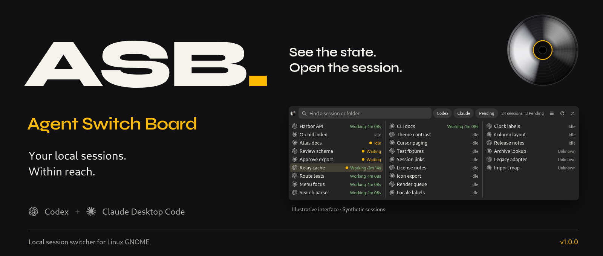

# ASB

**Agent Switch Board** is a native GNOME switcher for your Codex and Claude Desktop Code chats. Select a chat to open it in its original app. ASB makes no model calls.



https://github.com/user-attachments/assets/c85742f4-d1b0-4ffc-9497-144069fec36b

## Install on Linux

[Download v1.6.1](https://github.com/Jamir-boop/ASB/releases/tag/v1.6.1) · [Release notes](docs/releases/v1.6.1.md) · [Checksums](https://github.com/Jamir-boop/ASB/releases/download/v1.6.1/SHA256SUMS)

Needs Node.js `>=20` (`sqlite3` below `22.13`), Python 3 with PyGObject, GTK `>=4.12`, Libadwaita `>=1.4`, and `xdg-utils`.

Install Codex and Claude Desktop first, with working `codex:` and `claude:` URL handlers.

**Debian:** [asb_1.6.1_all.deb](https://github.com/Jamir-boop/ASB/releases/download/v1.6.1/asb_1.6.1_all.deb)

```bash
sudo apt install ./asb_1.6.1_all.deb
asb
```

**Portable (per-user):** [asb-1.6.1-linux.tar.gz](https://github.com/Jamir-boop/ASB/releases/download/v1.6.1/asb-1.6.1-linux.tar.gz)

```bash
tar -xzf asb-1.6.1-linux.tar.gz
cd asb-1.6.1
./install.sh
~/.local/bin/asb
```

[User guide](ASB.md) · [Privacy](docs/PRIVACY.md) · [Source setup](ASB.md#start-and-stop) · [Contributing](CONTRIBUTING.md)

Based on [Agent Mission Control 0.6.0](https://github.com/forxidian/agent-mission-control/releases/tag/v0.6.0) by **forxidian**. [MIT license](LICENSE).
