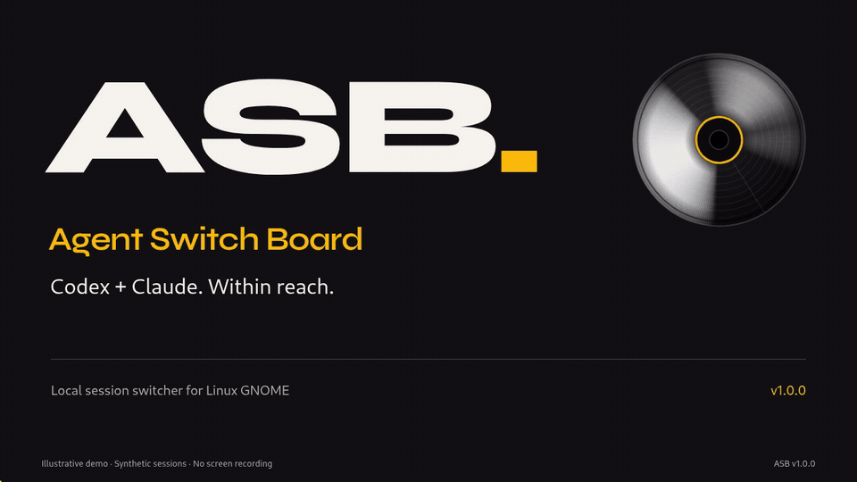

# ASB

**Agent Switch Board** puts your current local Codex and Claude Desktop Code chats in one small native GNOME window. See which chats need attention, then open the original app. ASB makes no model calls.


[Download v1.0.0](https://github.com/Jamir-boop/ASB/releases/tag/v1.0.0) · [Release notes](docs/releases/v1.0.0.md) · [User guide](ASB.md) · [Privacy](docs/PRIVACY.md)

## What it does

- Shows Working, Waiting, Idle, and Unknown states, plus the current working time when the source provides a start time.
- Keeps ASB Read/Unread marks and pins separate from the original apps. **Persistent unread** keeps attention marks until you choose **Read**.
- Uses adaptive columns, horizontal scroll, and **Compact** or **Comfortable** rows. Drag a divider to change all column widths.
- Filters by Codex, Claude, Pending, and state. Search names or folders with `cx:` / `codex:` and `cl:` / `claude:` prefixes.
- Uses GNOME colors or your own validated dark colors. Settings stay in ASB's local files.

## Demo



[Watch or download the MP4](https://github.com/Jamir-boop/ASB/releases/download/v1.0.0/asb-demo.mp4).

The demo is a scripted Remotion animation with synthetic sessions and folders. It illustrates the controls; it is not a recording of private chats or a performance test. Its source is in [demo/](demo/).

## Install on Linux

ASB v1.0.0 targets GNOME. It needs system Python 3 with PyGObject, GTK `>=4.10`, Libadwaita `>=1.4`, Node.js, and `xdg-utils`. Node.js `>=22.13` provides the built-in SQLite reader. Older supported Node.js versions (`>=20`) need the `sqlite3` command. The ASB runtime has no external npm dependencies.

Codex and Claude Desktop must already be installed with working `codex:` and `claude:` URL handlers. ASB does not install these apps or sign in to them. This release provides Linux packages only.

Download one package and [SHA256SUMS](https://github.com/Jamir-boop/ASB/releases/download/v1.0.0/SHA256SUMS) from the [release](https://github.com/Jamir-boop/ASB/releases/tag/v1.0.0). Check the download from the same folder:

```bash
sha256sum --ignore-missing -c SHA256SUMS
```

### Debian package

Download [asb_1.0.0_all.deb](https://github.com/Jamir-boop/ASB/releases/download/v1.0.0/asb_1.0.0_all.deb), then install it:

```bash
sudo apt install ./asb_1.0.0_all.deb
asb
```

The package declares the system runtime and `sqlite3` dependencies. The distribution must supply the required GTK and Libadwaita versions. Node.js `20` can read Codex through the SQLite CLI.

### Per-user portable package

Download [asb-1.0.0-linux.tar.gz](https://github.com/Jamir-boop/ASB/releases/download/v1.0.0/asb-1.0.0-linux.tar.gz), then install it for your user:

```bash
tar -xzf asb-1.0.0-linux.tar.gz
cd asb-1.0.0
./install.sh
~/.local/bin/asb
```

The portable package needs the same system runtime. Its installer checks the runtime before adding files. It adds an ASB launcher to your Applications menu and needs no `sudo`.

To remove the per-user install, run `~/.local/bin/asb --package uninstall`. To remove the Debian package, run `sudo apt remove asb`. Your ASB settings stay in place.

## Run from source

```bash
git clone https://github.com/Jamir-boop/ASB.git
cd ASB
npm run desktop
```

The native view uses GTK, with no browser or webview. Closing the window stops its backend. If port `4629` is busy, use `PORT=4630 npm run desktop`.

For the optional browser view, run `npm start` and open [http://127.0.0.1:4629/](http://127.0.0.1:4629/). Both launch modes bind only to `127.0.0.1`; `HOST` cannot expose ASB to the network.

## Develop

```bash
npm test
python3 test/asb_native_logic_test.py
npm run build
```

Use Node.js `>=22.13` for development. The Python logic check needs no display. Some retained upstream test fixtures need the `sqlite3` command. Package builds need `tar` and `dpkg-deb`. The build writes Linux packages and `SHA256SUMS` to `dist/`. The separate demo project has its own build dependencies.

Read [SYSTEM_OVERVIEW.md](SYSTEM_OVERVIEW.md) for the architecture and data limits, and [CONTRIBUTING.md](CONTRIBUTING.md) before a change.

## Privacy and limits

ASB reads local session stores and leaves them unchanged. It reads no login credentials, sends no telemetry, and makes no external network requests. It saves only its own attention, pin, layout, and theme settings. See [Privacy](docs/PRIVACY.md) for paths and details.

States come from local files and can lag the original app. A completion dot means that ASB observed a completion; it does not prove that a chat is unread in Claude. ASB opens existing chats and does not send prompts, run agents, or change their work.

## Credit and license

ASB is based on [Agent Mission Control 0.6.0](https://github.com/forxidian/agent-mission-control/releases/tag/v0.6.0) by **forxidian**. The original [MIT LICENSE](LICENSE) stays unchanged. ASB has its own `1.0.0` release series. The retained upstream code and history are described in [docs/upstream/README.md](docs/upstream/README.md) and [CHANGELOG.md](CHANGELOG.md).
